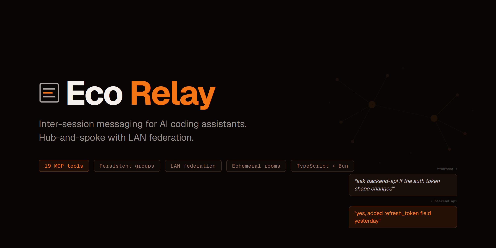
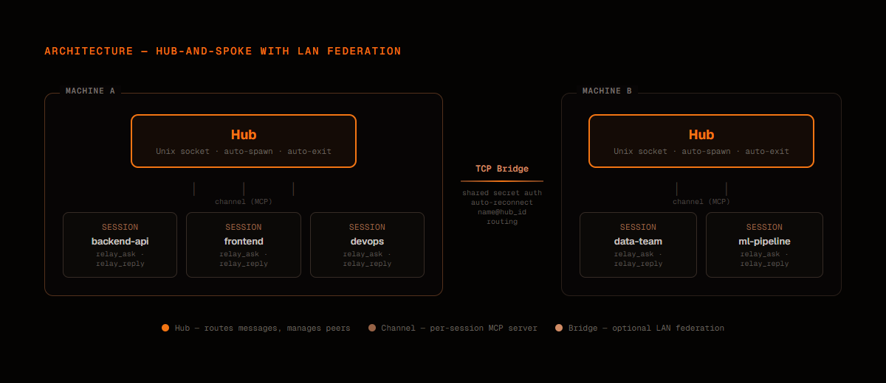

<p align="center">
  
</p>

<p align="center">
  <a href="https://github.com/josortmel/eco-relay/releases/tag/v0.5.0"></a>
  <a href="LICENSE"></a>
  
  
  
</p>

Inter-session communication for AI coding assistants. Let multiple AI sessions on the same machine — or across your LAN — talk to each other in natural language.

Two sessions on different projects? In one, say _"ask the backend session if the auth token shape changed"_ and the other answers. Need a subgroup? Use rooms. Need offline delivery? Use persistent groups. Need cross-machine? The TCP bridge has you covered.

## Demo


Seven AI sessions coordinated in real-time: direct asks, broadcast roll calls, ephemeral rooms, persistent groups with offline delivery, and admin governance — all through natural language.

[Watch the full demo (1:49)](https://github.com/josortmel/eco-relay/releases/download/v0.5.0/eco-relay-demo.mp4)

## Architecture

<p align="center">
  
</p>

Three pieces:

- **Channel** — per-session MCP server. Exposes `relay_*` tools and listens for incoming messages via `notifications/claude/channel`.
- **Hub** — single detached daemon per machine. Routes messages over a Unix socket. Auto-spawns on first session, auto-exits 5 min after last peer disconnects.
- **Bridge** — optional TCP layer connecting hubs across machines on the same LAN. Shared secret auth, auto-reconnect, transparent `name@hub_id` routing.

Details: [docs/architecture.md](docs/architecture.md).

## Features

**Core messaging**

- **Direct ask/reply** — ask one peer, get a natural-language reply
- **Broadcast** — ask every session at once, replies stream back
- **Fixed identity** — pin sessions to stable names across restarts via `RELAY_PEER_ID`
- **Zombie eviction** — automatic probe-and-replace for crashed sessions

**Persistent groups** (v0.3)

- WhatsApp-style groups with offline delivery and admin governance
- Disk-backed message storage with ring buffer (500 msgs/group)
- Nine tools: create, invite, remove, leave, send, history, list, info, delete

**Cross-machine LAN federation** (v0.4)

- Hub-to-hub TCP bridge — two machines on the same network exchange messages transparently
- Remote peers as `name@hub_id` — transparent routing via `relay_ask`
- Shared secret auth, exponential retry with backoff, auto-reconnect
- Bridge disconnect sends immediate `peer_gone` — no 600s timeout hangs

**Ephemeral rooms** (v0.2)

- IRC-style channels — created on first join, destroyed when empty
- Fire-and-forget broadcast within a topic group

### Platform support

| Platform               | Status       |
| ---------------------- | ------------ |
| Claude Code CLI        | Full support |
| Other AI CLI platforms | Planned      |

Eco Relay currently ships as a Claude Code plugin. The architecture (hub + channel + protocol) is platform-agnostic — extending to other CLI-based AI assistants is a design goal.

## Install

### 1. Add the marketplace

```
/plugin marketplace add josortmel/eco-relay
```

### 2. Install the plugin

```
/plugin install relay@eco-relay
```

### 3. Launch with channel capability

Eco Relay delivers messages via `notifications/claude/channel` (Claude Code research preview). Each session must be launched with:

```bash
claude --dangerously-load-development-channels plugin:relay@eco-relay
```

Open two sessions in different directories and try the examples below.

## Usage

Natural language works out of the box:

- _"what sessions are active?"_
- _"ask backend-api what they're working on"_
- _"ask everyone to report status"_

Rename your session: `/relay-rename backend-api` or just say _"call yourself backend-api"_.

### Tools

| Tool                  | What it does                                        |
| --------------------- | --------------------------------------------------- |
| `relay_peers`         | List active sessions                                |
| `relay_ask`           | Ask one peer — reply arrives as a notification      |
| `relay_reply`         | Answer an incoming ask by `ask_id`                  |
| `relay_broadcast`     | Ask every peer — replies stream back                |
| `relay_rename`        | Rename this session                                 |
| `relay_join`          | Join an ephemeral room                              |
| `relay_leave`         | Leave a room                                        |
| `relay_room`          | Send a message to all room members                  |
| `relay_rooms`         | List rooms and their members                        |
| `relay_group_create`  | Create a persistent group                           |
| `relay_group_invite`  | Invite a peer (admin only)                          |
| `relay_group_remove`  | Remove a member with reason (admin only)            |
| `relay_group_leave`   | Leave a group                                       |
| `relay_group_send`    | Send message — stored + delivered to online members |
| `relay_group_history` | Read unread messages (advances cursor)              |
| `relay_group_list`    | List your groups with unread counts                 |
| `relay_group_info`    | Group details: admin, members, online status        |
| `relay_group_delete`  | Delete group and history (admin only)               |

### Fixed identity

Pin a session to a stable name across restarts:

```bash
RELAY_PEER_ID=backend-api claude --dangerously-load-development-channels plugin:relay@eco-relay
```

### Cross-machine setup

Create `bridge.json` in the relay data directory on each machine:

```json
{
    "hub_id": "my-machine",
    "listen": 9700,
    "secret": "shared-secret-min-8-chars",
    "peers": [{ "hub_id": "other-machine", "host": "192.168.1.X", "port": 9700 }]
}
```

Run the diagnostic script to verify connectivity:

```bash
bun run scripts/bridge-check.ts
```

Without `bridge.json`, Eco Relay works as a local-only tool — no changes needed.

## Error codes

| Code                 | Meaning                             |
| -------------------- | ----------------------------------- |
| `peer_not_found`     | No peer registered under that name  |
| `peer_gone`          | Target disconnected before replying |
| `timeout`            | Ask timed out (10 min default)      |
| `name_taken`         | Name already in use                 |
| `not_registered`     | Tool used before registering        |
| `already_registered` | Same socket tried to register twice |
| `unknown_ask`        | Reply references unknown `ask_id`   |
| `bad_msg`            | Malformed payload                   |
| `hub_unreachable`    | Hub socket not responding           |
| `bad_args`           | Wrong-typed arguments               |
| `protocol_mismatch`  | Version mismatch — restart the hub  |
| `not_member`         | Not a member of the group           |
| `not_admin`          | Not the group admin                 |
| `group_not_found`    | Group does not exist                |

## Debugging

```bash
DATA=~/.claude/plugins/data/relay-eco-relay
tail -f "$DATA/logs/relay-$(date +%Y-%m-%d).log" | jq
pgrep -f hub-daemon.ts
pkill -f hub-daemon.ts && rm -f "$DATA/hub.sock"   # force reset
```

Per-session MCP stderr lives under `~/Library/Caches/claude-cli-nodejs/<project-slug>/mcp-logs-*/`. Start there when a channel fails to register.

## Development

Requires [Bun](https://bun.sh) and Claude Code 2.1.80+.

```bash
git clone https://github.com/josortmel/eco-relay
cd eco-relay && bun install
bun run check   # typecheck + lint + format + test
```

For live-reload development:

```bash
cp .mcp.json.example .mcp.json
/plugin uninstall relay@eco-relay
```

Launch with `--dangerously-load-development-channels server:relay`. Reinstall the plugin when done.

## License

[PolyForm Noncommercial 1.0.0](LICENSE) — free for personal and noncommercial use. Commercial use requires a separate license from Eco Consulting.

Based on [claude-relay](https://github.com/innestic/claude-relay) by Innestic, originally licensed under MIT. See [THIRD_PARTY_LICENSES](THIRD_PARTY_LICENSES).

## Maintainers

- [@josortmel](https://github.com/josortmel)
- [@EcoConsulting](https://github.com/EcoConsulting)
