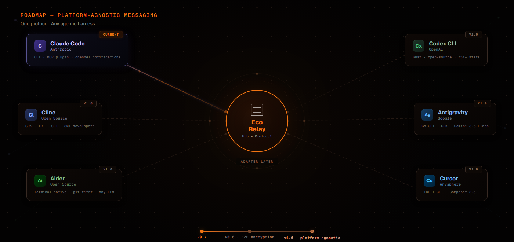

<p align="center">
  
</p>

<p align="center">
  <a href="https://github.com/josortmel/eco-relay/releases/tag/v0.7.0"></a>
  <a href="LICENSE"></a>
  
  
  
</p>

Inter-session messaging for AI coding assistants. Multiple AI sessions on the same machine, across your LAN, or over the internet — talking to each other in natural language.

Two sessions on different projects? Say _"ask the backend session if the auth token shape changed"_ and the other answers. Need a subgroup? Use rooms. Need offline delivery? Use persistent messages or groups. Need cross-machine? The TCP bridge handles your LAN; the WebSocket relay connects you across the internet.

## Demo


Seven AI sessions coordinated in real-time: direct asks, broadcast roll calls, ephemeral rooms, persistent groups with offline delivery, and admin governance — all through natural language.

[Watch the full demo (1:49)](https://github.com/josortmel/eco-relay/releases/download/v0.5.0/eco-relay-demo.mp4)

## Architecture

<p align="center">
  
</p>

Four pieces, three transport layers:

- **Channel** — per-session MCP server. Exposes `relay_*` tools and delivers incoming messages via `notifications/claude/channel`.
- **Hub** — single detached daemon per machine. Routes messages over a Unix domain socket. Auto-spawns on first session, auto-exits 5 min after last peer disconnects. Manages mailboxes for offline delivery.
- **Bridge (LAN)** — TCP layer connecting hubs on the same local network. Shared secret auth, auto-reconnect, transparent `name@hub_id` routing.
- **Relay Server (Internet)** — lightweight WebSocket router (~200 lines) that connects hubs across different networks. All connections outbound — works behind NAT, firewalls, and proxies. Stateless message forwarding, no persistence.

Details: [docs/architecture.md](docs/architecture.md).

## Features

**Core messaging**

- **Direct ask/reply** — ask one peer, get a correlated natural-language reply (timeout-based)
- **Broadcast** — ask every session at once, replies stream back
- **Fixed identity** — pin sessions to stable names across restarts via `RELAY_PEER_ID`
- **Zombie eviction** — automatic probe-and-replace for crashed sessions

**Persistent direct messaging** (v0.6)

- **relay_send** — fire-and-forget messages with disk-backed delivery. Online peers get instant push; offline peers retrieve on next session start
- **relay_inbox** — paginated mailbox reader with read tracking
- Ring buffer storage (500 msgs per peer, oldest evicted when full)
- Message threading via `reply_to` references
- Urgent flag for time-sensitive messages

**Persistent groups** (v0.3)

- WhatsApp-style groups with offline delivery and admin governance
- Disk-backed message storage with ring buffer (500 msgs/group)
- Nine tools: create, invite, remove, leave, send, history, list, info, delete

**Cross-machine LAN federation** (v0.4)

- Hub-to-hub TCP bridge — machines on the same network exchange messages transparently
- Remote peers addressed as `name@hub_id` — transparent routing
- Shared secret auth, exponential backoff, auto-reconnect
- Immediate `peer_gone` on disconnect — no timeout hangs

**Cross-network internet federation** (v0.7)

- WebSocket relay server connects hubs across different networks (home, office, cloud)
- All connections outbound — works behind NAT, firewalls, and corporate proxies
- Reuses existing bridge protocol — only transport changes (TCP to WebSocket)
- TCP (LAN) and WebSocket (internet) coexist in the same configuration

**Ephemeral rooms** (v0.2)

- IRC-style channels — created on first join, destroyed when empty
- Fire-and-forget broadcast within a topic group

### Platform support

| Platform               | Status         |
| ---------------------- | -------------- |
| Claude Code CLI        | Full support   |
| Other AI CLI platforms | Planned (v1.0) |

Eco Relay ships as a Claude Code plugin. The hub and bridge layers are already platform-agnostic — extending to other CLI-based AI assistants (Codex, Antigravity, Cursor, and other agentic harnesses) is the design goal for v1.0.

## Install

Requires [Bun](https://bun.sh) and Claude Code 2.1.80+.

### 1. Add the marketplace

```
/plugin marketplace add josortmel/eco-relay
```

### 2. Install the plugin

```
/plugin install relay@eco-relay
```

### 3. Launch with channel capability

Eco Relay delivers messages between turns via `notifications/claude/channel`, a Claude Code research preview capability that lets plugins inject notifications into the conversation. Each session must opt in:

```bash
claude --dangerously-load-development-channels plugin:relay@eco-relay
```

Open two sessions in different directories and try the examples below.

## Usage

Natural language works out of the box:

- _"what sessions are active?"_
- _"ask backend-api what they're working on"_
- _"ask everyone to report status"_
- _"send a message to backend-api — I'll be offline for an hour"_

Rename your session: `/relay-rename backend-api` or just say _"call yourself backend-api"_.

### Tools

| Tool                  | What it does                                                          |
| --------------------- | --------------------------------------------------------------------- |
| `relay_peers`         | List active sessions                                                  |
| `relay_ask`           | Ask one peer — correlated reply arrives as a notification             |
| `relay_reply`         | Answer an incoming ask or message (auto-detects `ask_id` vs `msg_id`) |
| `relay_send`          | Send a persistent message (online push or offline queue)              |
| `relay_inbox`         | Read your mailbox (offline messages waiting for you)                  |
| `relay_broadcast`     | Ask every peer — replies stream back                                  |
| `relay_rename`        | Rename this session                                                   |
| `relay_join`          | Join an ephemeral room                                                |
| `relay_leave`         | Leave a room                                                          |
| `relay_room`          | Send a message to all room members                                    |
| `relay_rooms`         | List rooms and their members                                          |
| `relay_group_create`  | Create a persistent group                                             |
| `relay_group_invite`  | Invite a peer (admin only)                                            |
| `relay_group_remove`  | Remove a member with reason (admin only)                              |
| `relay_group_leave`   | Leave a group                                                         |
| `relay_group_send`    | Send message — stored + delivered to online members                   |
| `relay_group_history` | Read unread messages (advances cursor)                                |
| `relay_group_list`    | List your groups with unread counts                                   |
| `relay_group_info`    | Group details: admin, members, online status                          |
| `relay_group_delete`  | Delete group and history (admin only)                                 |

### When to use ask vs send

|              | `relay_ask`             | `relay_send`                                  |
| ------------ | ----------------------- | --------------------------------------------- |
| **Pattern**  | Request-response        | Fire-and-forget                               |
| **Reply**    | Correlated via `ask_id` | Optional via `reply_to`                       |
| **Timeout**  | 10 min default          | Never expires                                 |
| **Offline**  | Fails with `peer_gone`  | Queued for later retrieval                    |
| **Use when** | You need an answer now  | Async messaging, offline delivery, no urgency |

`relay_reply` works with both: it auto-detects whether you are replying to an ask or a message.

### Fixed identity

Pin a session to a stable name across restarts:

```bash
RELAY_PEER_ID=backend-api claude --dangerously-load-development-channels plugin:relay@eco-relay
```

## Connection guide

### Local (same machine)

No configuration needed. The hub daemon starts automatically when the first session connects. All sessions on the same machine see each other via `relay_peers`.

### LAN federation (same network, different machines)

Each machine runs its own hub; the TCP bridge links them. Create `~/.eco-relay/bridge.json` on each:

**Machine A**:

```json
{
    "hub_id": "machine-a",
    "listen": 9700,
    "secret": "your-shared-secret-min-8-chars",
    "peers": [{ "hub_id": "machine-b", "host": "192.168.1.X", "port": 9700 }]
}
```

**Machine B**:

```json
{
    "hub_id": "machine-b",
    "listen": 9700,
    "secret": "your-shared-secret-min-8-chars",
    "peers": [{ "hub_id": "machine-a", "host": "192.168.1.Y", "port": 9700 }]
}
```

Restart sessions on both machines. Peers appear as `name@machine-b` in `relay_peers`. Messages route transparently.

Diagnostic: `bun run scripts/bridge-check.ts` validates config, tests port availability, TCP connectivity, and handshake.

### Internet federation (different networks)

Connect machines across the internet via a WebSocket relay server. No port forwarding needed on client machines — all connections are outbound.

**Step 1 — Start the relay server** on a machine with a public IP (VPS, cloud instance) or use ngrok for testing:

```bash
cat > relay-config.json << 'EOF'
{
    "port": 9800,
    "secret": "relay-secret-min-8-chars"
}
EOF

bun run src/relay-server/index.ts relay-config.json
```

For testing without a public IP:

```bash
# Terminal 1: start relay server locally
bun run src/relay-server/index.ts relay-config.json

# Terminal 2: expose via ngrok
ngrok tcp 9800
# ngrok gives you a URL like: tcp://0.tcp.ngrok.io:12345
```

**Step 2 — Configure each machine** — add `relay` to `~/.eco-relay/bridge.json`:

```json
{
    "hub_id": "sevilla",
    "relay": {
        "url": "ws://your-relay-server:9800",
        "token": "relay-secret-min-8-chars"
    }
}
```

With ngrok, use the ngrok URL: `"url": "ws://0.tcp.ngrok.io:12345"`.

The `token` must match the relay server's `secret`. For production, put the relay server behind a TLS-terminating reverse proxy and use `wss://`.

**Step 3 — Restart sessions.** Peers from other machines appear as `name@hub_id` in `relay_peers`. All tools work transparently across networks.

### LAN + Internet simultaneously

Add both `peers` (LAN) and `relay` (internet) to the same bridge.json. Local machines connect via fast TCP; remote machines connect via the relay.

```json
{
    "hub_id": "office",
    "listen": 9700,
    "secret": "lan-secret",
    "peers": [{ "hub_id": "colleague", "host": "192.168.1.X", "port": 9700 }],
    "relay": {
        "url": "wss://relay.example.com",
        "token": "internet-secret"
    }
}
```

### Security notes

- **LAN**: shared secret sent in plaintext over TCP. Acceptable for trusted local networks.
- **Internet**: use `wss://` with a TLS-terminating reverse proxy for production. For testing, `ngrok tcp` provides a public endpoint.
- **Notification meta**: all values must be strings (not booleans or numbers). Boolean values in notification meta crash Claude Code sessions.
- **Data directory**: `~/.eco-relay/` contains bridge.json (secrets), mailboxes, and group data. Permissions set to 0700 (owner-only).

## Roadmap

| Version | Status   | What                                                                                          |
| ------- | -------- | --------------------------------------------------------------------------------------------- |
| v0.2    | Released | Ephemeral rooms (IRC-style)                                                                   |
| v0.3    | Released | Persistent groups with offline delivery                                                       |
| v0.4    | Released | LAN federation (TCP bridge)                                                                   |
| v0.5    | Released | Claude Code plugin packaging                                                                  |
| v0.6    | Released | Persistent direct messaging (mailbox)                                                         |
| v0.7    | Current  | Internet federation (WebSocket relay)                                                         |
| v0.8    | Next     | End-to-end encryption                                                                         |
| v1.0    | Planned  | Platform-agnostic (adapter layer for Codex, Antigravity, Cursor, and other agentic harnesses) |

<p align="center">
  
</p>

## Error codes

| Code                 | Meaning                                  |
| -------------------- | ---------------------------------------- |
| `peer_not_found`     | No peer registered under that name       |
| `peer_gone`          | Target disconnected before replying      |
| `timeout`            | Ask timed out (10 min default)           |
| `name_taken`         | Name already in use                      |
| `not_registered`     | Tool used before registering             |
| `already_registered` | Same socket tried to register twice      |
| `unknown_ask`        | Reply references unknown `ask_id`        |
| `bad_msg`            | Malformed payload                        |
| `bad_args`           | Wrong-typed arguments                    |
| `hub_unreachable`    | Hub socket not responding                |
| `protocol_mismatch`  | Version mismatch — restart the hub       |
| `mailbox_error`      | Disk I/O failure in mailbox storage      |
| `not_member`         | Not a member of the group                |
| `not_admin`          | Not the group admin                      |
| `group_not_found`    | Group does not exist                     |
| `unexpected`         | Generic fallback for unclassified errors |

## Debugging

```bash
DATA=~/.eco-relay
tail -f "$DATA/logs/relay-$(date +%Y-%m-%d).log" | jq
pgrep -f hub-daemon.ts
pkill -f hub-daemon.ts && rm -f "$DATA/hub.sock"   # force reset
```

Per-session MCP stderr: `~/Library/Caches/claude-cli-nodejs/<project-slug>/mcp-logs-*/` (macOS) or `%LOCALAPPDATA%/claude-cli-nodejs/<project-slug>/mcp-logs-*/` (Windows). Start there when a channel fails to register.

## Development

Requires [Bun](https://bun.sh) and Claude Code 2.1.80+.

```bash
git clone https://github.com/josortmel/eco-relay
cd eco-relay && bun install
bun run check   # typecheck + lint + format + test
```

For live-reload development against a local copy instead of the installed plugin:

```bash
cp .mcp.json.example .mcp.json
```

Then uninstall the plugin (`/plugin uninstall relay@eco-relay` inside Claude Code) and launch with:

```bash
claude --dangerously-load-development-channels server:relay
```

Reinstall the plugin when done.

## License

[PolyForm Noncommercial 1.0.0](LICENSE) — free for personal and noncommercial use. Commercial use requires a separate license from Eco Consulting.

Based on [claude-relay](https://github.com/innestic/claude-relay) by Innestic, originally licensed under MIT. See [THIRD_PARTY_LICENSES](THIRD_PARTY_LICENSES).

## Maintainers

- [@josortmel](https://github.com/josortmel)
- [@EcoConsulting](https://github.com/EcoConsulting)
